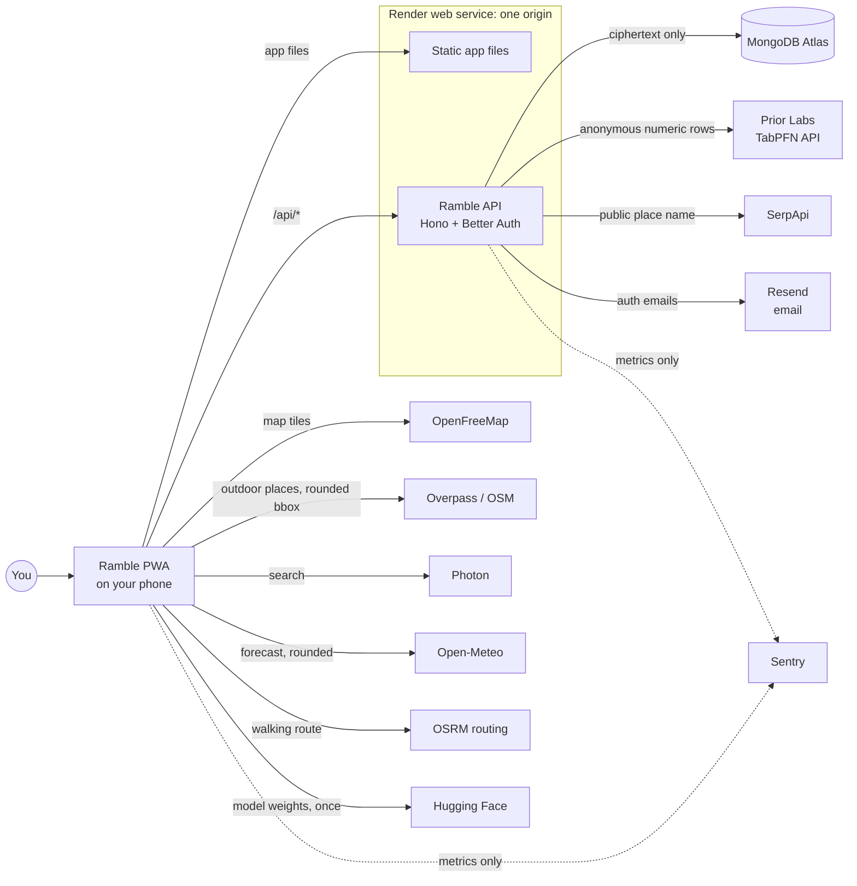
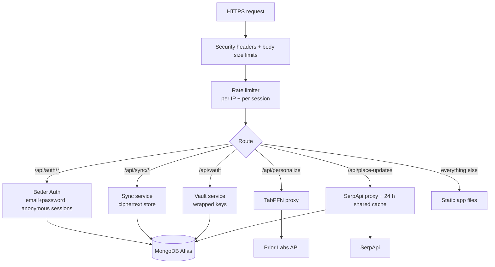
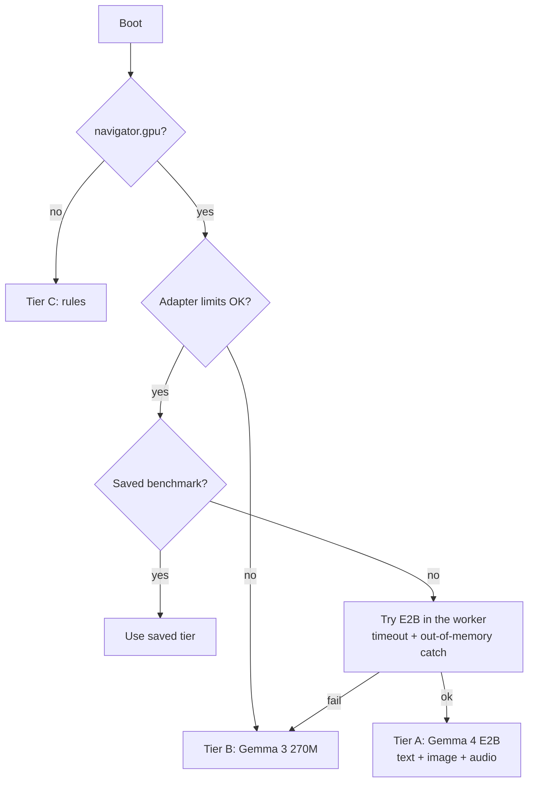
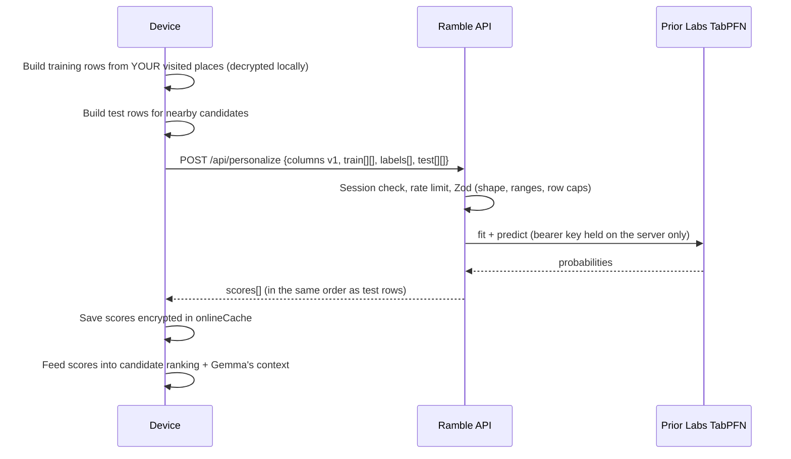
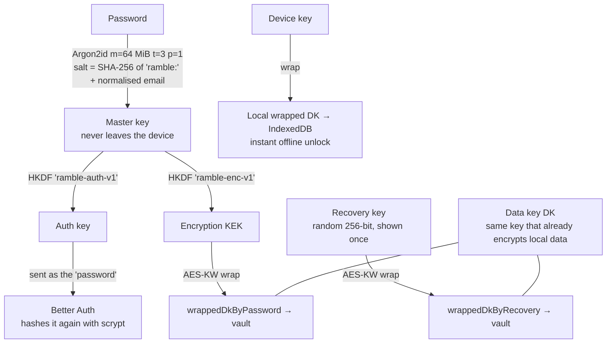
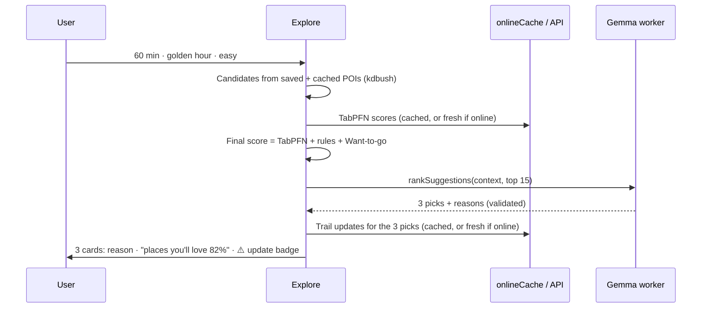
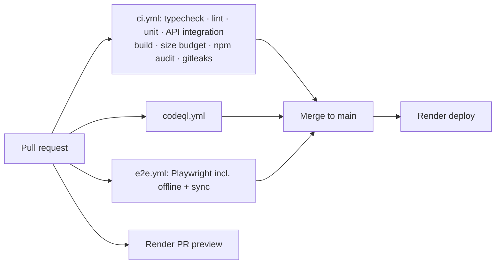

# Ramble: System Design & Architecture

> Ramble is an **offline-first, online-enhanced** personal explore map. It remembers the places you love, levels them up each time you return, nudges you outside, and turns your walks into a private journal.
> The core AI (**Gemma**, an open-weight model) runs **on your phone**, so the core features work with zero bars. When you're online, Ramble gets smarter: personalised predictions (**TabPFN**), fresh trail and park updates (**SerpApi**), and an optional account with **end-to-end-encrypted** backup and sync (**MongoDB Atlas**).
>
> Companion docs: [SECURITY.md](SECURITY.md) (threat model and security design) · [hacktoberfest-guide.md](hacktoberfest-guide.md) (challenge plan, prizes, timeline)

**Scope tags used throughout:**
- **[P1]**: core, built first
- **[P2]**: online enhancements, built second
- **[P3]**: accounts and sync, built third
- **[L]**: later, after the challenge

---

## Contents
1. [Design principles](#1-design-principles)
2. [System context](#2-system-context)
3. [High-level architecture](#3-high-level-architecture)
4. [Tech stack](#4-tech-stack)
5. [Project structure](#5-project-structure)
6. [Data model](#6-data-model)
7. [On-device AI pipeline (Gemma)](#7-on-device-ai-pipeline-gemma)
8. [Personalisation (TabPFN)](#8-personalisation-tabpfn)
9. [Trail and park updates (SerpApi)](#9-trail-and-park-updates-serpapi)
10. [Accounts and end-to-end-encrypted sync (MongoDB Atlas)](#10-accounts-and-end-to-end-encrypted-sync-mongodb-atlas)
11. [Backend API](#11-backend-api)
12. [Offline and online strategy](#12-offline-and-online-strategy)
13. [Key flows](#13-key-flows)
14. [Performance design](#14-performance-design)
15. [Deployment and infrastructure](#15-deployment-and-infrastructure)
16. [Observability (Sentry)](#16-observability-sentry)
17. [Testing strategy](#17-testing-strategy)
18. [CI/CD](#18-cicd)
19. [Roadmap](#19-roadmap)
20. [Open questions to resolve first](#20-open-questions-to-resolve-first)

---

## 1. Design principles

| # | Principle | What it means in practice |
|---|---|---|
| 1 | **Offline-first** | The phone's database is the source of truth. Map, places, check-ins, walks, journal and Gemma all work with no signal. |
| 2 | **Online-enhanced** | Online features add value but **never block** anything. Offline, they show the last saved result or hide themselves. |
| 3 | **Zero-knowledge server** | The server stores only **ciphertext** it can't read. Your places, visits, photos and journal are encrypted on the phone before they're synced. |
| 4 | **Account optional** | Use Ramble instantly. Sign up only to back up and sync across devices. |
| 5 | **Private by design** | Third parties receive only what a feature needs, coarsened or anonymised, always through our backend, never with identifiers. |
| 6 | **Secure by default** | Encryption is always on, strict CSP, every input treated as untrusted. See SECURITY.md. |
| 7 | **AI that can't make up places** | Gemma ranks and describes real places the app supplies. TabPFN only scores them. Neither can invent places or take actions. |
| 8 | **Fast on a mid-range phone** | Strict performance budgets. The model runs in a worker. The app shell is served from the service worker cache. |
| 9 | **Graceful degradation** | If WebGPU, the model, the network or the backend is missing, the app still works, just more simply. |
| 10 | **One origin, small surface** | The app and the API are served from the **same origin**, so there's no CORS and no third-party cookies. Few dependencies. |

---

## 2. System context



**Who receives what:**

| Service | Receives | Never receives |
|---|---|---|
| **Ramble API (Render)** | Session cookie; encrypted records; anonymous feature rows; public place names to look up | Plaintext places, visits, notes, photos, the password, encryption keys |
| **MongoDB Atlas** | Ciphertext envelopes, wrapped (encrypted) keys, auth records (email, double-hashed auth key) | Any plaintext user content |
| **Prior Labs (TabPFN)** | Numeric rows such as `[kind=3, distBucket=2, hourBucket=4, …]` with labels | Names, coordinates, ids, the user's identity or IP (proxied) |
| **SerpApi** | A public place name + suburb (e.g. "Merri Creek Trail, Northcote") | Who asked (proxied, results shared across users), coordinates |
| **Resend** | The email address, for verification and password-reset emails only | Anything else |
| OpenFreeMap | The map tiles you view | Your data |
| Overpass | A **rounded** bounding box of about 5 km | Your exact location, your history |
| Photon | Search text + a rounded bias point | Your history |
| Open-Meteo | Lat/lon at 2 decimals (~1 km) | Anything else |
| Routing | The start and end of a route you request | Your history |
| Hugging Face | One-time model download | Anything else |
| Sentry | Timings and errors, content scrubbed | Coordinates, notes, prompts, outputs, emails |

---

## 3. High-level architecture

### 3.1 Client (on the phone)

```mermaid
flowchart TB
    subgraph Main[Main thread]
        UI[React UI<br/>tabs, sheets, map]
        Store[Zustand store<br/>decrypted in-memory view]
        Repo[Repository<br/>encrypt / decrypt / validate]
        Sync[Sync engine<br/>push / pull / merge]
        Online[Online services client<br/>TabPFN, trail updates, auth]
        Map[MapLibre GL]
    end
    subgraph Workers[Background threads]
        AIW[AI worker: Gemma]
        SW[Service worker: Workbox]
    end
    subgraph Storage[On-device storage]
        IDB[(IndexedDB: encrypted records)]
        Cache[(Cache API: shell, tiles)]
        OPFS[(OPFS: model weights)]
    end
    UI <--> Store <--> Repo <--> IDB
    Repo <--> Sync --> APIc[/api/sync]
    UI --> Online --> APIo[/api/*]
    UI <--> Map --> SW <--> Cache
    UI <-- Comlink --> AIW --> OPFS
```

### 3.2 Server (Render web service)



### 3.3 Client layers

| Layer | Responsibility | Rule |
|---|---|---|
| **UI** (`features/*`) | Screens, sheets, map layers | Never touches IndexedDB, crypto or `fetch` directly |
| **Store** | Decrypted in-memory state | The only thing the UI reads |
| **Repository** | CRUD, encryption, validation, migrations | **Only** this layer reads or writes IndexedDB |
| **Crypto** | Keys, AES-GCM, wrapping, Argon2id | Pure functions on WebCrypto + hash-wasm |
| **Sync engine** | Push and pull ciphertext, client-side last-write-wins merge | Never sees plaintext outside the repository |
| **Online client** | Typed calls to `/api/*`, timeouts, results saved for offline use | Every call has an offline fallback |
| **AI client / worker** | Gemma load, inference, validation, fallbacks | The worker has no network or DOM access |
| **Net** | One `safeFetch`: host allow-list, rounding, timeouts | All outbound traffic goes through it |
| **Geo** | Distance, spatial index, sun times, polyline | Pure, unit-tested |

---

## 4. Tech stack

All open source unless marked (SaaS). Exact versions are pinned in `package-lock.json`.

### 4.1 Client
| Concern | Tool |
|---|---|
| Language / UI / build | **TypeScript** (strict), **React 19**, **Vite** |
| Styling / animation | **Tailwind CSS v4**, **motion** |
| State / worker RPC | **Zustand**, **Comlink** |
| Validation | **Zod** (shared with the server) |
| Auth client | **better-auth** client |
| Map | **MapLibre GL JS** (CSP build, self-hosted worker), **OpenFreeMap** Liberty |
| Geo | **kdbush** + **geokdbush**, **suncalc**, polyline encoding |
| Places / search / weather / routing | **Overpass** (OSM), **Photon**, **Open-Meteo**, **OSRM** (FOSSGIS) |
| Database | **Dexie** (IndexedDB) |
| Large files | **OPFS** |
| PWA | **vite-plugin-pwa** (Workbox, `injectManifest`) |
| Crypto | **WebCrypto** (AES-GCM-256, AES-KW, HKDF, SHA-256) + **hash-wasm** (Argon2id, streaming SHA-256) |
| Password strength | **zxcvbn-ts** + Have I Been Pwned range API (k-anonymity: only the first 5 hash characters are sent) |
| Media | `createImageBitmap` + `OffscreenCanvas` (resize + EXIF strip), `MediaRecorder` + `AudioContext` |
| Compression | Native `CompressionStream` |

### 4.2 On-device AI
| Concern | Tool |
|---|---|
| Main model | **Gemma 4 E2B** (text + image + audio) |
| Runtimes | **LiteRT-LM Web** (`@litert-lm/core`, WebGPU, constrained decoding); backup **Transformers.js** (`onnx-community/gemma-4-E2B-it-ONNX`, q4f16) |
| Small-device model | **Gemma 3 270M** (Transformers.js, fp32 on WebGPU or WASM) |
| Embeddings [L] | **EmbeddingGemma** |
| No-WebGPU fallback | Rule-based ranker |

### 4.3 Server
| Concern | Tool |
|---|---|
| Runtime | **Node.js 22 LTS** |
| HTTP framework | **Hono** (small, fast, typed) + `@hono/node-server` |
| Auth | **Better Auth** (email + password, email verification, password reset, **anonymous** sessions, session management) + `@better-auth/mongo-adapter` |
| Database | **MongoDB Atlas** (SaaS) via the official `mongodb` driver; **GridFS** for encrypted photo blobs |
| Validation | **Zod** (shared package) |
| Rate limiting | Better Auth's built-in limiter (auth routes) + `hono-rate-limiter` with a MongoDB store (other routes) |
| Security headers | Hono `secureHeaders` middleware + an explicit CSP |
| Logging | **pino** with redaction (cookies, auth headers and bodies are never logged) |
| Email | **Resend** (SaaS) for verification and reset emails |
| Partner APIs | **Prior Labs TabPFN REST API** (`/tabpfn/*` routes), **SerpApi** (`serpapi` npm package) |
| Telemetry | **Sentry** Node SDK |

### 4.4 Quality and operations
| Concern | Tool |
|---|---|
| Unit / integration tests | **Vitest**, **fake-indexeddb**, **mongodb-memory-server** |
| End-to-end tests | **Playwright** (WebKit + Chromium, offline mode) |
| Lint / format | **ESLint** (`typescript-eslint`, `no-unsanitized`, `security`, `react-hooks`), **Prettier** |
| Performance | **Lighthouse CI**, `size-limit`, `rollup-plugin-visualizer` |
| Security | **CodeQL**, **gitleaks**, `npm audit`, **Dependabot** |
| Hosting | **Render** (web service + blueprint) |
| Build sessions | **Entire CLI** |
| Demo narration | **ElevenLabs** |

---

## 5. Project structure

Monorepo using **npm workspaces**: one repo, three packages.

```
ramble/
├─ apps/
│  ├─ web/                          # the PWA
│  │  ├─ public/
│  │  │  ├─ icons/  manifest.webmanifest
│  │  │  └─ wasm/                   # self-hosted model runtime WASM (no CDN)
│  │  ├─ src/
│  │  │  ├─ main.tsx  sw.ts
│  │  │  ├─ app/                    # App shell, store slices, boot sequence
│  │  │  ├─ features/
│  │  │  │  ├─ map/                 # MapLibre, pin layer, locate, long-press
│  │  │  │  ├─ places/              # place sheet, levels
│  │  │  │  ├─ checkin/             # one-tap check-in, "where are you?"
│  │  │  │  ├─ explore/             # "Get me outside", moods, suggestion cards
│  │  │  │  ├─ walk/                # routes, live walk banner, loops
│  │  │  │  ├─ journal/             # timeline, memory composer
│  │  │  │  ├─ updates/             # trail & park updates card (SerpApi)
│  │  │  │  ├─ offline/             # "Get ready for offline" wizard
│  │  │  │  ├─ account/             # sign up / in, recovery key, devices, sync status
│  │  │  │  ├─ share/               # share links
│  │  │  │  └─ settings/            # privacy screen, lock, backup, delete-all, toggles
│  │  │  ├─ lib/
│  │  │  │  ├─ crypto/              # keys, aead, wrap, argon2, account-keys, recovery
│  │  │  │  ├─ db/                  # Dexie schema, repo, migrations
│  │  │  │  ├─ sync/                # push, pull, merge, outbox
│  │  │  │  ├─ ai/                  # Gemma client, capability, prompts, schemas, fallback
│  │  │  │  ├─ personalize/         # feature extraction, TabPFN client, score cache
│  │  │  │  ├─ geo/  net/  media/  offline/  telemetry/
│  │  │  ├─ workers/ai.worker.ts
│  │  │  └─ ui/                     # Sheet, Button, Chip, Toast …
│  │  ├─ index.html  vite.config.ts
│  └─ api/                          # the backend
│     ├─ src/
│     │  ├─ index.ts                # Hono app: headers, limits, routes, static files
│     │  ├─ auth.ts                 # Better Auth config
│     │  ├─ db.ts                   # Mongo client, collections, indexes
│     │  ├─ routes/
│     │  │  ├─ sync.ts  vault.ts  media.ts
│     │  │  ├─ personalize.ts       # TabPFN proxy
│     │  │  ├─ placeUpdates.ts      # SerpApi proxy + cache
│     │  │  └─ account.ts           # export, delete account
│     │  ├─ middleware/             # rateLimit, requireSession, bodyLimit, logger
│     │  └─ lib/                    # tabpfn client, serpapi client, quota, errors
│     └─ test/
├─ packages/
│  └─ shared/                       # Zod schemas + types shared by web and api
│     └─ src/ envelope.ts  sync.ts  personalize.ts  placeUpdates.ts
├─ docs/  ARCHITECTURE.md  SECURITY.md  hacktoberfest-guide.md
├─ tests/e2e/                       # Playwright
├─ .github/workflows/  ci.yml  codeql.yml  e2e.yml
├─ .github/dependabot.yml
├─ render.yaml
├─ package.json                     # workspaces
├─ .npmrc  .gitignore  LICENSE  README.md
```

---

## 6. Data model

### 6.1 The encrypted envelope (on the device **and** on the server)

```ts
// On the device (IndexedDB)
interface LocalEnvelope {
  id: string;              // random UUIDv4
  kind: Kind;              // local index only; NOT sent to the server
  updatedAt: number;       // local index only
  dirty: 0 | 1;            // has changes not yet synced
  v: 1;
  iv: Uint8Array;          // 12 random bytes, fresh for every write
  ct: ArrayBuffer;         // AES-GCM(DK, JSON{ kind, updatedAt, deleted, data }, AAD = `${id}:${v}`)
}

// What the server stores (MongoDB `records`)
interface ServerEnvelope {
  userId: ObjectId;
  id: string;              // same random UUID
  seq: number;             // server-assigned, increases per user (the sync cursor)
  v: 1;
  iv: Binary;
  ct: Binary;              // opaque; kind, timestamps and the deleted flag are all INSIDE
  size: number;
  receivedAt: Date;
}
```

**Metadata minimisation.** The server can't tell a place from a visit or a journal entry. It doesn't know when you visited (the timestamps are encrypted) or whether a record is deleted (tombstones are encrypted too). It sees only random ids, sizes and when uploads arrived (see SECURITY.md §9 on traffic timing).

### 6.2 Domain types (decrypted, in memory only)

```ts
type Level = 'want' | 'visited' | 'favourite' | 'regular' | 'legend';

interface Place {
  id: string; name: string; lat: number; lon: number;
  kind: 'park'|'trail'|'viewpoint'|'water'|'garden'|'forest'|'beach'|'cafe'|'custom'|string;
  osmId?: string; tags: string[]; wantToGo: boolean; loved?: boolean;
  createdAt: number;
}
interface Visit   { id: string; placeId: string; at: number; source: 'checkin'|'walk-arrival';
                    with?: string[]; journalId?: string;
                    context: { hourBucket: number; dow: number; weather: WeatherBucket; tempBucket: number } }
interface Walk    { id: string; kind: 'to-place'|'loop'; targetPlaceId?: string; plannedRoute?: string;
                    track: string; startedAt: number; endedAt?: number; distanceM: number }
interface JournalEntry { id: string; visitId?: string; walkId?: string; title: string; body: string;
                    tags: string[]; sighting?: { guess: string; confidence: 'low'|'medium' };
                    mediaIds: string[]; aiAssisted: boolean; createdAt: number }
interface Media   { id: string; mime: string; role: 'photo'|'thumb'|'voice'; width?: number; height?: number }
interface SuggestionFeedback { id: string; placeId: string; at: number; action: 'accepted'|'skipped'|'walked' }
```

`Visit.context` and `SuggestionFeedback` are the **personalisation signals**. They stay encrypted on the device, and only anonymous numeric features derived from them are ever sent (§8).

### 6.3 Device tables (Dexie)

| Table | Contents | Encrypted? |
|---|---|---|
| `records` | Envelopes for place, visit, walk, journal, list and feedback records | ✅ |
| `media` | Photo, thumbnail and voice blobs | ✅ |
| `outbox` | Ids waiting to sync | ids only |
| `poiCache` | Public OSM POIs for downloaded areas | ❌ public data |
| `areas` | Downloaded area packs (bbox rounded to ~5 km) | ❌ (cleared by delete-all) |
| `weather` | Forecast per rounded cell | ❌ |
| `onlineCache` | Last TabPFN scores, last trail updates (with fetch time) | ✅ (they reveal interests) |
| `keys` | Wrapped data key(s), salts, lock mode | wrapped |
| `meta` | Schema version, model tier, benchmarks, sync cursor, settings | ❌ non-sensitive |

### 6.4 Server collections (MongoDB Atlas)

| Collection | Fields | Indexes |
|---|---|---|
| `user`, `session`, `account`, `verification` | Managed by Better Auth (email, hashed auth key, sessions) | Better Auth defaults |
| `vault` | `userId`, `wrappedDkByPassword {iv, ct}`, `wrappedDkByRecovery {iv, ct}`, `kdf {alg, m, t, p}`, `v` | `userId` unique |
| `records` | Server envelopes (§6.1) | `{userId:1, id:1}` unique; `{userId:1, seq:1}` |
| `counters` | `userId`, `seq` | `userId` unique |
| `media.files` / `media.chunks` | GridFS: encrypted blobs; metadata `{userId, id}` | `{metadata.userId:1, metadata.id:1}` unique |
| `placeUpdatesCache` | `queryHash`, `results[]`, `fetchedAt` (public data, shared) | `queryHash` unique; TTL 24 h |
| `rateLimits` | Rate-limiter counters | TTL |

### 6.5 Levels
Derived from the visit count, never stored: **want** (0, Want to go) → **visited** (1) → **favourite** (2) → **regular** (5) → **legend** (10). Can't drift out of sync.

---

## 7. On-device AI pipeline (Gemma)

### 7.1 Capability detection and tiers


| Tier | Model | Features |
|---|---|---|
| A | Gemma 4 E2B | Suggestions, journal from voice, photo or text, sighting guesses, summaries of trail updates |
| B | Gemma 3 270M | Suggestions, journal from text, summaries of trail updates |
| C | Rules | Templated reasons; the journal is saved as typed; trail updates shown as headlines |

### 7.2 Worker lifecycle
1. Download once into OPFS, with a **streaming SHA-256** check against a pinned hash.
2. Load lazily, during idle time after the map is interactive.
3. Keep it warm, and **clone** the conversation with the system prompt already processed for each request.
4. Every request can be cancelled with an `AbortSignal`.
5. Release the engine after 5 minutes hidden or under memory pressure.

### 7.3 Tasks
| Task | Input | Output (Zod-validated) | Fallback |
|---|---|---|---|
| `rankSuggestions` | Context + ≤15 candidates (with their **TabPFN score** when available) | `{ picks: [{ id, reason ≤140 }] }` × 3 | Rule ranker |
| `draftJournal` | Note text / audio / one image + place name | `{ title ≤60, body ≤600, tags ≤6, sighting? }` | Raw note |
| `summarizeUpdates` | ≤5 trail-update snippets (untrusted web text) + place name | `{ headline ≤120, severity: 'info'\|'caution'\|'closed'\|'none' }` | First headline as-is |
| `nameSpot` [L] | Nearby POI kinds | `{ name ≤40 }` | "Spot near X" |

### 7.4 Guardrails
- Constrained decoding to a JSON schema, then Zod validation; one retry, then fallback.
- Picks must reference **ids from the candidate list**. Unknown ids are dropped.
- Untrusted text (OSM names, user notes, **web snippets**) goes into delimited data fields, and the model is told to treat it as data.
- The model has **no tools and no network access**. Its output is displayed as plain text with length caps.
- The user edits journal drafts before they're saved. Sightings are labelled as guesses.
- The model is told never to give safety-critical advice (edible plants, whether a trail is safe).

---

## 8. Personalisation (TabPFN)

**Goal:** "Places you'll love". Predict how likely you are to love a candidate place, based on your own history. **[P2]**

### 8.1 How it works


### 8.2 Feature schema (`columns v1`), all numeric and anonymous

| # | Feature | Encoding |
|---|---|---|
| 1 | Place kind | Category index (park=0, trail=1, viewpoint=2, water=3, garden=4, forest=5, beach=6, café=7, other=8) |
| 2–7 | Has tag: quiet, view, shade, water, dog-friendly, toilets | 0/1 |
| 8 | Distance from your usual area | Bucket 0–5 (<500 m … >10 km) |
| 9 | Typical visit hour | Bucket 0–5 (early morning … night) |
| 10 | Weekend? | 0/1 |
| 11 | Weather at visit | 0 clear, 1 cloudy, 2 rain |
| 12 | Temperature | Bucket 0–4 |
| 13 | Suggestion accepted before? | 0/1 |

**Label:** `loved = 1` if the place reached *favourite* (2+ visits) or you hearted it, otherwise `0`.

**Never sent:** names, coordinates, OSM ids, place ids, timestamps or the user id. Rows are anonymous, and the server forwards them without logging.

### 8.3 Rules
- **Opt-in toggle:** "Smarter suggestions (sends anonymous numbers, never places)". It's off until the user turns it on, with a "see exactly what's sent" preview.
- **Cold start:** needs at least 15 visited places with at least 3 positive labels. Until then, the rule ranker and Gemma are used. The UI says "Ramble is still learning your taste (8/15)".
- **Caps:** 500 training rows, 50 test rows, 13 columns, so each request stays cheap against Prior Labs' fair-usage limit.
- **Refresh:** when the candidate set changes and the cached scores are more than 24 h old.
- **Offline:** the last scores are used. Places without a score fall back to rules.
- **Final ranking score:** `0.45 × TabPFN + 0.35 × rule score (distance, never-visited, sunset, weather) + 0.20 × Want-to-go boost`. Gemma then picks 3 from the top 15 and explains why.

---

## 9. Trail and park updates (SerpApi)

**Goal:** before you head out, show any **recent closures, works, events or alerts** for the place. **[P2]**

### 9.1 Flow
1. When a place sheet opens or a walk is planned while online, the device calls `GET /api/place-updates?name=<public name>&area=<suburb>`.
   - The name and suburb come from public OSM data. **No coordinates are sent.**
   - **Custom pins you named yourself are never looked up**, because their names may be private ("Mum's house").
2. The API normalises the query and checks the **shared 24 h cache** in `placeUpdatesCache`. Results are public, so caching across users is safe and saves quota.
3. On a cache miss it calls SerpApi (Google, results from the past month), with a query like `"<name>" <area> (closure OR closed OR event OR works OR alert)`.
4. It returns ≤5 results `{title, snippet, source, date, url}`. The server validates URLs (`https:` only) and caps snippet lengths.
5. On the device, **Gemma summarises** the results into a one-line headline with a severity (`info`, `caution`, `closed` or `none`).
6. The result is saved encrypted in `onlineCache`. Offline, the card shows "Last checked 2 h ago".

### 9.2 Quota protection
- The SerpApi free plan is about **250 searches a month** (check serpapi.com/pricing). Protection layers: the shared cache, a per-session limit (10/hour), a global daily budget (8/day, enforced in Mongo), and lookups only when the user explicitly opens a place or plans a walk (no background fetching).
- When the budget runs out, the card says "Updates unavailable right now" and nothing else breaks.

### 9.3 Safety
Web snippets are **untrusted**: they're shown as plain text, links open only for `https:` with `rel="noopener noreferrer"`, and they go to Gemma as data only. The card always says: "From the web, may be out of date. Check official sources."

---

## 10. Accounts and end-to-end-encrypted sync (MongoDB Atlas)

**[P3]** Optional. Ramble works fully without an account.

### 10.1 Account modes
| Mode | How you get it | What you get |
|---|---|---|
| **Guest** (default) | Open the app | Everything on the device. Online features use an **anonymous session** (Better Auth anonymous plugin) for rate limiting |
| **Account** | Sign up with email + password | Plus encrypted backup, multi-device sync, recovery. The anonymous session is linked to the new account |

Google sign-in isn't offered. With an OAuth login there's no password to derive an encryption key from, which would weaken end-to-end encryption (a passkey-based option is planned [L]).

### 10.2 Keys: zero-knowledge, Bitwarden-style


- **The server never sees the password or the master key.** It receives only the derived auth key, which it hashes again, so even a full database leak needs an Argon2id brute-force attack **per user**.
- **The data key stays the same.** A guest who signs up keeps their existing local data key, so nothing is re-encrypted. It just gets wrapped two more ways.
- **Recovery key:** 256 random bits shown once as a grouped code (e.g. `RMBL-7Q4K-…`). The user must save it, and the app confirms they have by asking for 4 characters back.
- **Password change:** derive the new master key, re-wrap the data key, update the auth key. Instant.
- **Forgot password:**
  - The email reset restores **login**.
  - The vault then needs the **recovery key**, *or* any still-signed-in device, which re-wraps the data key under the new password.
  - Without either, the old encrypted data can't be recovered, by design. The UI says this clearly at sign-up.

### 10.3 Sync protocol
| Step | Detail |
|---|---|
| **Push** | `POST /api/sync/push` with up to 100 envelopes (each ≤ 64 KB). The server assigns `seq = ++counter[userId]` and **upserts** by `{userId, id}`. |
| **Pull** | `GET /api/sync/pull?since=<seq>&limit=500` → envelopes with `seq > since`, plus `nextSeq`. |
| **Merge** | **On the device**: decrypt, compare the inner `updatedAt`, newer wins. If the local copy is newer, mark it dirty, so it's re-pushed. |
| **Tombstones** | Deletions are encrypted records with `deleted: true` inside. They're compacted after 90 days [L]. |
| **Media** | `PUT /api/media/:id` (encrypted blob, ≤ 2 MB, streamed into GridFS). `GET` streams it back. Per-user quota: **50 MB** (Atlas free tier is 512 MB in total). Upload happens after the record syncs. |
| **When** | On app open, after local writes (debounced 5 s), when the device comes back online, and when a "Sync now" button is tapped. Pulls and pushes are batched to reduce timing leaks. |
| **Conflicts** | Last write wins on the device's `updatedAt`. A device clock that's badly wrong could lose an edit. That's accepted for now, and a vector clock is planned [L]. |

### 10.4 Account management
- **Devices:** list sessions, sign out a device, sign out everywhere.
- **Export:** an encrypted `.ramble` backup file, which also works for guests.
- **Delete account:** deletes the user's records, media, vault, sessions and auth records in one server transaction, then crypto-shreds the device too. Typed confirmation is required.

---

## 11. Backend API

All routes are under `/api`, same origin as the app, JSON only, Zod-validated, and size-limited.

| Method | Route | Auth | Limit | Purpose |
|---|---|---|---|---|
| * | `/api/auth/*` | – | Better Auth limiter (sign-in 5/min/IP) | Sign up / in / out, verify email, reset, anonymous session |
| GET | `/api/vault` | account | 30/min | Get wrapped keys |
| PUT | `/api/vault` | account (fresh session) | 5/min | Set or re-wrap keys |
| POST | `/api/sync/push` | account | 60/min | Upload envelopes |
| GET | `/api/sync/pull` | account | 60/min | Download envelopes |
| PUT/GET/DELETE | `/api/media/:id` | account | 30/min | Encrypted blobs |
| POST | `/api/personalize` | any session | 10/hour | TabPFN proxy |
| GET | `/api/place-updates` | any session | 10/hour + global daily budget | SerpApi proxy + cache |
| GET | `/api/account/export` | account | 2/hour | All ciphertext as one file |
| DELETE | `/api/account` | account (fresh session + password) | 2/hour | Delete everything |
| GET | `/api/health` | – | – | Uptime check (no details) |

**Error format:** `{ error: { code, message } }`. There are no stack traces in responses and no hints about whether an account exists.

---

## 12. Offline and online strategy

### 12.1 Feature matrix
| Feature | Offline | Online adds |
|---|---|---|
| Map + your pins | ✅ cached area | Any area |
| Search | ✅ your places + cached POIs | Photon worldwide |
| Check-in, levels, journal | ✅ | Sync to your other devices |
| Gemma suggestions, journal drafting | ✅ | – |
| "Places you'll love" | ✅ last saved scores | Fresh TabPFN scores |
| Trail and park updates | ✅ last result + age | Fresh SerpApi results |
| Walk to a place | ✅ saved route / straight-line direction | A new OSRM route |
| Weather and sunset | ✅ cached forecast (3 days); sunset always | Fresh forecast |
| Backup and sync | Queued in the outbox | Sync |

### 12.2 What's cached where
| Asset | Store | Strategy | Size |
|---|---|---|---|
| App shell, WASM | Cache API | Precached, versioned | ~1–2 MB |
| Style, fonts, sprites, tiles | Cache API | Cache-first; the wizard prefetches z10–z14 for your area | A few MB |
| POIs | IndexedDB | Wizard; refreshed after 14 days | < 1 MB |
| Weather | IndexedDB | Stale-while-revalidate | KBs |
| Gemma weights | OPFS | Downloaded once, hash-checked | E2B ≈ 1–2 GB (verify), 270M ≈ 300–600 MB |
| Online results | IndexedDB (encrypted) | Last good result + time | KBs |
| Your data | IndexedDB (encrypted) | Source of truth | Grows |

### 12.3 "Get ready for offline" wizard
1. Ask for persistent storage with `navigator.storage.persist()`. On iOS, show an **Install to Home Screen** tip, because installed apps avoid Safari's 7-day eviction.
2. Check free space with `storage.estimate()` and offer the smaller model if space is tight.
3. Tiles, POIs, weather, then the model (with a hash check and a one-time benchmark).
4. Finish with **"Ramble is ready for zero bars ✓"**.

### 12.4 Connectivity
- `navigator.onLine` plus a probe of `/api/health`. Online-only buttons show clear disabled states, never endless spinners.
- The sync outbox is retried with exponential backoff. Online lookups (TabPFN, updates) **aren't queued**. They simply run next time.

---

## 13. Key flows

### 13.1 First launch (guest)
Service worker installs → generate the data key and device key → anonymous session (quietly, only if online) → welcome card → "Show where I am" (explained first) → map + "Get ready for offline" card.

### 13.2 Get me outside


### 13.3 Walk, arrive, memory
1. Route from OSRM (online), saved on the walk record. Offline: the saved route, or a straight-line direction.
2. `watchPosition` **only in walk mode**, throttled, saved every 15 s.
3. Arrival within 40 m → check in → level-up celebration.
4. Memory: photo (resized, EXIF stripped) / voice / text → Gemma draft → the user edits → saved encrypted → queued for sync.

### 13.4 Sign up (from guest)
```mermaid
sequenceDiagram
    participant U as User
    participant D as Device
    participant A as API
    U->>D: Email + password (strength meter + breached-password check)
    D->>D: Argon2id → master key → auth key + encryption key
    D->>A: Better Auth sign-up (email, auth key), linked to the anonymous session
    A-->>U: Verification email (Resend)
    D->>D: Generate recovery key; wrap DK twice
    D->>A: PUT /api/vault {wrappedDkByPassword, wrappedDkByRecovery}
    D->>U: "Save your recovery key" (confirm 4 characters)
    D->>A: First full push of envelopes + media
```

### 13.5 Sign in on a new device
Email + password → derive the keys → sign in with the auth key → `GET /api/vault` → unwrap the data key with the encryption key → wrap it with a new device key locally → pull all envelopes → decrypt into the store → media downloads lazily.

---

## 14. Performance design

### 14.1 Budgets (enforced in CI where possible)
| Metric | Budget |
|---|---|
| Initial JS (gzip), excluding MapLibre | ≤ 120 KB |
| MapLibre chunk (gzip) | ≤ 260 KB, in parallel |
| First Contentful Paint, repeat visit (service worker) | ≤ 0.8 s |
| First Contentful Paint, first visit (mid-range phone, 4G) | ≤ 1.5 s |
| Map interactive (warm) | ≤ 1.5 s |
| Unlock + decrypt 500 places | ≤ 150 ms |
| API p95 (sync push of 100 records) | ≤ 300 ms |
| `/api/place-updates` p95, cache hit / miss | ≤ 80 ms / ≤ 3 s |
| `/api/personalize` p95 | ≤ 4 s (runs in the background; the UI never waits on it) |
| Main-thread long tasks during inference | 0 |

### 14.2 Techniques
- **Code splitting by tab and sheet.** Account, sync and Argon2 code loads only when used.
- **Pins on the GPU.** A single GeoJSON source with symbol layers, not DOM markers.
- **kdbush spatial index** in memory. **Batched decryption**, with places first and media loaded lazily.
- **Images:** 1600 px WebP, 256 px thumbnails, 768 px for Gemma.
- **Gemma:** kept warm, system-prompt processing reused, short outputs, streamed reasons.
- **Online lookups never block.** Suggestions render from rules and cache instantly, and TabPFN scores and updates **refine** the cards when they arrive.
- **Sync** runs in the background and in batches. Pull is paginated.
- **Server:** Hono on Node; Mongo indexes on every query path; connection pooling; shared SerpApi cache; gzip/brotli for JSON; static assets `immutable`.
- **Cold starts:** Render **free** instance (no card needed). It sleeps after 15 minutes idle, so the first request afterwards takes ~30–60 s. Repeat visits still open instantly because the service worker serves the app shell from cache; only API calls wait. Wake the service before demos. Region **Singapore** (closest to Australia).

---

## 15. Deployment and infrastructure

### 15.1 Why one origin
The API serves the built PWA **and** `/api/*` from one Render web service:
- Session cookies are **first-party** (`SameSite=Lax`, `HttpOnly`, `Secure`). They aren't blocked by Safari, and there's no CORS.
- The CSP `connect-src` for our API is simply `'self'`.
- There's one deploy, one set of headers, and one thing to secure.

### 15.2 `render.yaml`
```yaml
services:
  - type: web
    runtime: node
    name: ramble
    region: singapore
    plan: free
    buildCommand: npm ci && npm run build      # builds packages/shared, apps/web, apps/api
    startCommand: node apps/api/dist/index.js  # serves /api/* and the PWA's static files
    healthCheckPath: /api/health
    autoDeploy: true
    envVars:
      - key: NODE_ENV
        value: production
      - key: MONGODB_URI
        sync: false            # set in the dashboard, never committed
      - key: BETTER_AUTH_SECRET
        generateValue: true
      - key: BETTER_AUTH_URL
        sync: false
      - key: TABPFN_API_KEY
        sync: false
      - key: SERPAPI_KEY
        sync: false
      - key: RESEND_API_KEY
        sync: false
      - key: SENTRY_DSN
        sync: false
```
Security headers are set **in the Hono app** (SECURITY.md §5.1–5.2), so they apply to both the static files and the API.

### 15.3 MongoDB Atlas
- **M0 free cluster**, AWS **Sydney** region (or the closest available to Render Singapore).
- **Network access:** only Render's published outbound IP ranges for the Singapore region, **not** `0.0.0.0/0`.
- A database user with `readWrite` on the `ramble` database only. TLS is enforced by default.
- Separate `ramble_dev` and `ramble` databases. Indexes are created on startup in `db.ts`.

### 15.4 Environments
| Env | Where | Notes |
|---|---|---|
| Local | Vite (`https://localhost:5173`) proxying `/api` to the API on `:8787` | HTTPS for geolocation and the camera; `.env.local` (gitignored) |
| Preview | Render PR previews | Uses the `ramble_dev` database |
| Production | `ramble.onrender.com` (custom domain [L]) | `main` branch |

---

## 16. Observability (Sentry)

| Where | Captured | Never captured |
|---|---|---|
| Device: Gemma | Tier, load ms, time to first token, tokens/s, output tokens, fallback used, validation failures | Prompts, outputs, names |
| Device: performance | FCP, LCP, map-interactive, unlock ms, sync duration | URLs with queries, coordinates |
| Server: traces | Spans for each route, **TabPFN latency**, **SerpApi latency + cache hit rate**, Mongo query time | Bodies, cookies, emails, query strings |
| Errors (both) | Type, stack (source maps), release | Breadcrumbs from fetch, console or DOM (disabled) |

Settings: `sendDefaultPii: false`, `beforeSend` and `beforeSendSpan` scrubbers, no Session Replay, offline transport on the device, and an **opt-out toggle**. Together the device and server traces tell the whole agent story (Gemma → TabPFN → SerpApi). That's the **Sentry Agent Tracing** entry.

---

## 17. Testing strategy

| Level | What | Tool |
|---|---|---|
| Unit | Crypto: round trip, **tamper detection**, AAD binding, wrap/unwrap, Argon2 parameters, auth key ≠ encryption key | Vitest |
| Unit | Geo, levels, rule ranker, feature extraction (**asserts no names or coordinates in TabPFN rows**), polyline, rounding | Vitest |
| Unit | Zod schemas against malicious inputs (model output, web snippets, oversized payloads) | Vitest |
| Integration | Repository on fake-indexeddb; sync merge with two simulated devices and conflicting edits | Vitest |
| Integration (API) | Routes against **mongodb-memory-server**: auth flows, vault, push/pull, quotas, rate limits, **a user can never read another user's records** | Vitest |
| Contract | Shared Zod schemas used by both the web app and the API | Type checks |
| End-to-end | Offline wizard → offline mode → Explore, check-in, walk simulation; sign-up → second browser context signs in → data appears | Playwright |
| Security | CSP and headers on the preview URL, EXIF stripped, no HTML sinks (lint), secrets scan | CI |
| Manual | **Real iPhone, airplane mode, a real walk** | You 🌳 |

---

## 18. CI/CD


- `npm ci` only. `npm audit --audit-level=high` fails the build. Actions are pinned to commit SHAs, and the workflow token has `contents: read` only.
- Dependabot opens weekly grouped updates. Optional Copilot PR review.

---

## 19. Roadmap
| Feature | Notes |
|---|---|
| Passkey / Face ID unlock + passkey accounts [L] | WebAuthn PRF derives the encryption key, so no password is needed |
| Shared lists [L] | A per-list key carried in the invite link's `#` fragment, so the server sees only ciphertext |
| Google Takeout import [L] | Parsed on the device, and an instant head start for TabPFN |
| Offline routing [L] | Foot-network graph + A* in a worker |
| PMTiles region packs [L] | For large areas |
| Recaps, heatmap, explored hex map [L] | Computed on the device |
| Object storage for photos [L] | Cloudflare R2 / S3 when 512 MB isn't enough |
| Vector-clock conflict resolution [L] | Replaces last-write-wins |

---

## 20. Open questions to resolve first

1. **Does Gemma 4 E2B run on your iPhone** (Safari 26, WebGPU)? Measure load time, tokens/s and memory.
2. **Model files:** exact sizes, a pinned revision, and whether they're **gated** (gated files can't be downloaded anonymously by a browser).
3. **Does LiteRT-LM Web accept image and audio input?** If not, use Transformers.js for those.
4. **Which hosts do Hugging Face downloads redirect to?** Needed for the CSP. And are the runtime workers and WASM self-hostable?
5. **TabPFN REST:** the exact `/tabpfn/*` request flow (prepare upload → upload → fit → predict) and the free usage limits for our row and column caps.
6. **SerpApi** current free quota. Which engine gives the best closure and event results (Google vs Google News)?
7. **Better Auth:** the anonymous plugin → account linking with the Mongo adapter; mounting under Hono; using the auth key as the password.
8. **Render:** outbound IP ranges for Singapore (for the Atlas allow-list); claim the credits.
9. **Entire CLI** on Windows.
