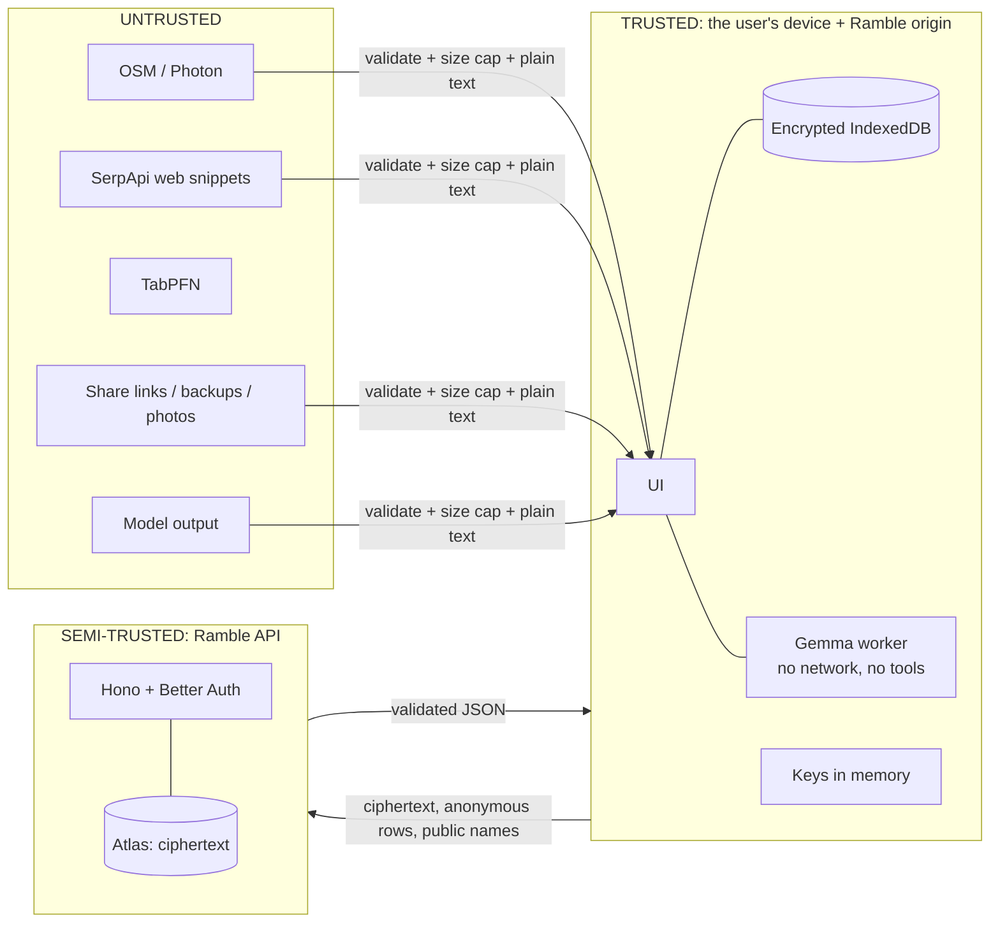
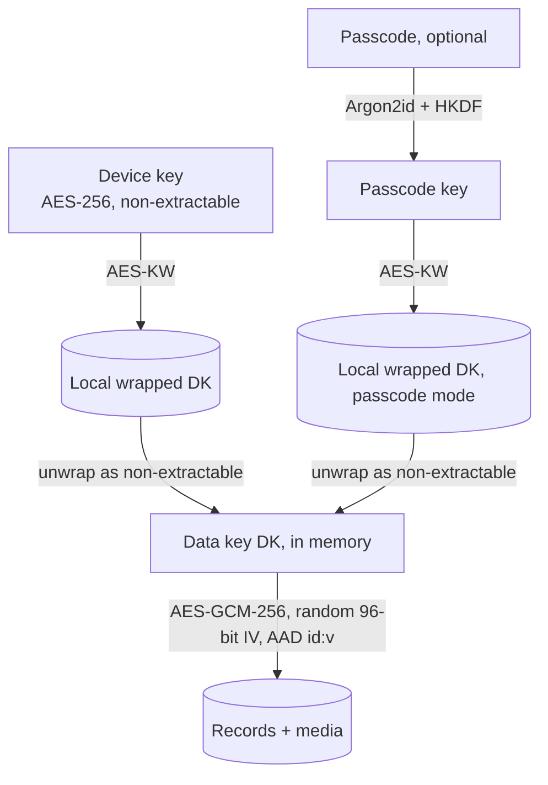
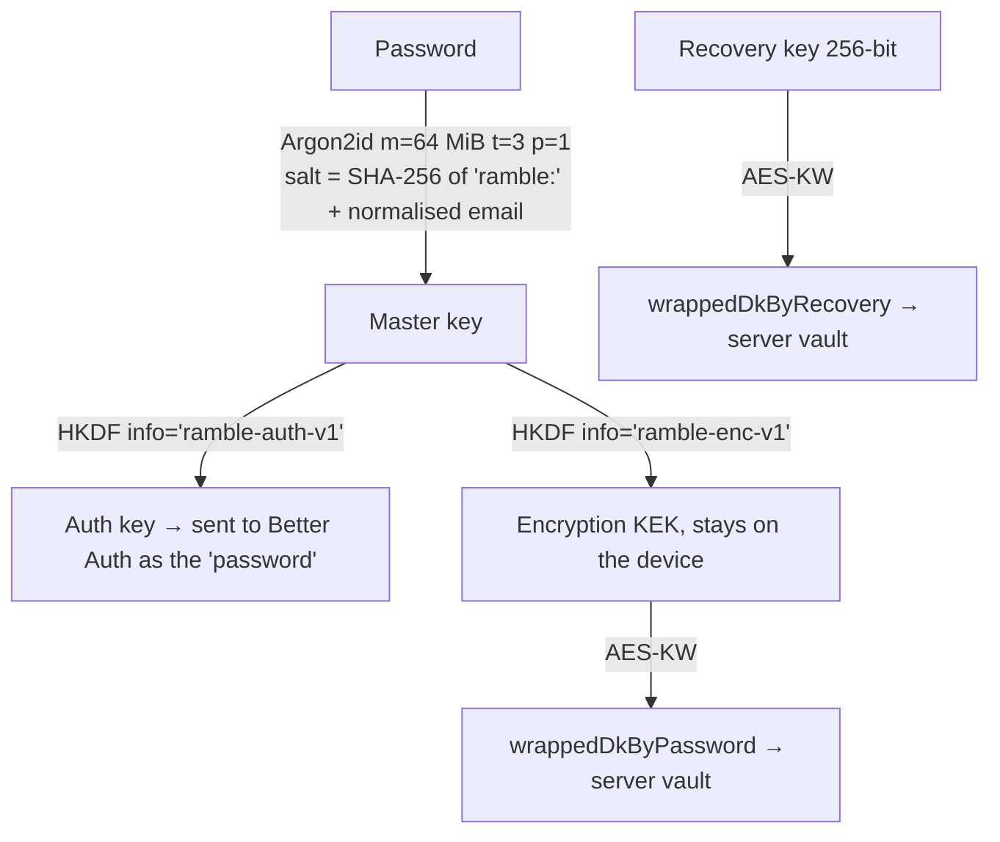

# Ramble: Security & Privacy Design

> Ramble holds some of the most sensitive data a person has: **where they go, when they go there, who they're with, their photos and their private thoughts.** Location history can reveal a home address, a routine, health visits and relationships, and it can be used for stalking.
> This document explains how Ramble protects that data on the **phone**, on the **server**, and with **partner services**, which attacks it defends against, and, honestly, which risks remain.
>
> Companion docs: [ARCHITECTURE.md](ARCHITECTURE.md) · [hacktoberfest-guide.md](hacktoberfest-guide.md)

**Scope tags:** **[P1]** core · **[P2]** online enhancements · **[P3]** accounts and sync · **[L]** later

---

## Contents
1. [Our security stance](#1-our-security-stance)
2. [Security principles](#2-security-principles)
3. [Assets: what we protect](#3-assets-what-we-protect)
4. [Threat model](#4-threat-model)
5. [Client security controls](#5-client-security-controls)
6. [Account, key and sync security](#6-account-key-and-sync-security)
7. [Server and API security](#7-server-and-api-security)
8. [Partner and third-party data flows](#8-partner-and-third-party-data-flows)
9. [Residual risks](#9-residual-risks)
10. [Data lifecycle](#10-data-lifecycle)
11. [Privacy commitments](#11-privacy-commitments)
12. [Secure development process](#12-secure-development-process)
13. [Incident response and vulnerability reporting](#13-incident-response-and-vulnerability-reporting)
14. [Security checklist by phase](#14-security-checklist-by-phase)

---

## 1. Our security stance

**No software is unbreakable**, and anyone who claims otherwise is selling something. Our goal is to make Ramble:

1. **Not worth breaching.** The server stores only **ciphertext it can't decrypt**. Even a complete database breach reveals no places, visits, photos or journal entries. Passwords are never sent, only a derived key that the server hashes again.
2. **Hard to attack individually.** Data is encrypted on the device, the attack surface is small, and every input is treated as untrusted.
3. **Contained when something fails.** Independent layers (defence in depth), so one failed control doesn't expose everything.
4. **Honest.** Users can see exactly what leaves their phone and what protection they actually have.

**The key architectural decision:** plaintext user data exists **only on the user's own devices**. The server is a "dumb" encrypted mailbox plus a few proxies for public data.

---

## 2. Security principles

| Principle | How Ramble applies it |
|---|---|
| **Zero-knowledge / end-to-end encryption** | Records and media are encrypted on the device before sync. Keys are derived on the device. The server holds only wrapped (encrypted) keys and ciphertext. |
| **Data minimisation** | Accounts are optional. Only an email is collected. Kind, timestamps and deleted flags are hidden inside the ciphertext. EXIF is stripped from photos. Voice recordings are discarded by default. TabPFN gets anonymous numbers only. SerpApi gets public names only. |
| **Defence in depth** | XSS: CSP + React escaping + lint + Trusted Types. Data at rest: OS encryption + app encryption + passcode. Server: auth + per-user query scoping + rate limits + network allow-list. |
| **Least privilege** | The AI has no tools. The database user is limited to one database. Atlas accepts connections only from Render's IPs. Browser permissions are requested only when needed. CI tokens are read-only. Partner keys live only on the server. |
| **Secure by default** | Encryption is always on. Telemetry contains no content. Personalisation is opt-in. Location is used only in the foreground. Cookies are `HttpOnly; Secure; SameSite`. |
| **Zero trust for inputs** | OSM data, model output, web snippets, share links, backups, API requests and responses are all validated against schemas and size limits. |
| **Fail secure** | Decryption failure means "unreadable", never partially trusted. A model hash mismatch means the file is deleted. Auth failures give generic errors. A missing session means 401. |
| **Small attack surface** | One origin, one service, few dependencies, no third-party scripts at runtime, no iframes. |
| **Standard crypto only** | WebCrypto (AES-GCM, AES-KW, HKDF), Argon2id, scrypt (Better Auth). **We never invent our own cryptography.** |
| **Transparency** | A privacy screen lists every outbound service. "See exactly what's sent" previews. Open source. |

---

## 3. Assets: what we protect

| Asset | Sensitivity | Where it lives |
|---|---|---|
| Visit history, GPS tracks | 🔴 Critical | Device (encrypted); server (ciphertext only, if signed in) |
| Photos, journal text, voice notes | 🔴 Critical | Device (encrypted); server (ciphertext only) |
| Companions ("With") | 🟠 High: third parties' data | Inside encrypted payloads |
| Saved places, tags, lists, feedback | 🟠 High | Same as above |
| **Data key** (DK) | 🔴 Critical | Device memory (non-extractable); wrapped copies on the device and in `vault` |
| **Password / master key** | 🔴 Critical | **Never stored or sent.** Exists in memory briefly during derivation |
| Recovery key | 🔴 Critical | Kept by the user. Only a DK wrapped with it is stored on the server |
| Email address | 🟠 High (identifying) | Better Auth `user` collection |
| Session cookies | 🔴 Critical (account takeover) | Browser cookie jar (`HttpOnly`) |
| Server secrets (Mongo URI, Better Auth secret, TabPFN, SerpApi, Resend keys) | 🔴 Critical | Render environment variables only |
| TabPFN feature rows | 🟡 Medium (anonymous behaviour patterns) | In transit only; cached scores on the device are encrypted |
| Downloaded area bboxes | 🟡 Medium | Device, rounded to about 5 km |
| Model weights | 🔴 **High integrity** | Device OPFS, hash-verified |
| App code as delivered | 🔴 **High integrity** | Render; service worker cache |

---

## 4. Threat model

### 4.1 Adversaries

| ID | Adversary | Capability | In scope? |
|---|---|---|---|
| A1 | **Someone with your unlocked phone** (a thief, a nosy friend, a controlling partner) | Opens the app | ✅ Passcode lock + auto-lock |
| A2 | **Someone with your locked phone, or a copy of the browser's storage** | Reads the files on disk | ✅ Encryption at rest |
| A3 | **XSS / injected script** | Runs JavaScript in our origin | ✅ CSP, no HTML sinks, Trusted Types |
| A4 | **Malicious data**: OSM names, web snippets, share links, backups, prompt injection | Supplies input | ✅ Validation, plain-text rendering, a model with no capabilities |
| A5 | **Network attacker** (public Wi-Fi, a malicious hotspot) | Reads or modifies traffic | ✅ TLS everywhere, HSTS preload, pinned model hash |
| A6 | **Supply chain**: npm, CDN, model host | Ships malicious code or weights | ✅ Lockfile, audits, self-hosting, pinned hashes |
| A7 | **Curious third-party service** (map, routing, TabPFN, SerpApi, Resend) | Sees requests | ✅ Rounding, anonymisation, proxying, minimisation |
| A8 | **Share-link recipient** | Sees shared content | ✅ Field allow-list + preview |
| A9 | **Database breach** (stolen Atlas credentials or backup) | Reads or modifies all collections | ✅ Ciphertext only; double-hashed auth keys; AEAD detects tampering |
| A10 | **Online attacker against accounts** (credential stuffing, brute force, enumeration, CSRF, session theft) | Calls the API | ✅ Rate limits, breached-password check, generic errors, `SameSite` cookies, origin checks |
| A11 | **Malicious or compromised server operator** (us, a compromised Render or GitHub account) | Changes the deployed code | ⚠️ Partly: 2FA, branch protection, CI (see residual risks) |
| A12 | **API abuse** (draining partner quotas, scraping) | Automated requests | ✅ Sessions, per-session and global budgets, caching |
| A13 | **Another Ramble user** | Tries to read or modify others' data | ✅ Every query is scoped to `userId` from the session, never from the request |
| – | A compromised OS, jailbroken phone, malicious extension, coercion | Full control | ❌ Out of scope for any web app |

### 4.2 Trust boundaries


The server is **semi-trusted**: it's trusted to deliver the app's code and to be available, but **never with plaintext data**.

### 4.3 STRIDE analysis

| Threat | Example | Mitigations | Phase |
|---|---|---|---|
| **S**poofing | Credential stuffing or password guessing | Rate limits (5/min/IP on sign-in), breached-password check at sign-up, strong-password policy, generic errors | P3 |
| **S**poofing | Session hijack | `HttpOnly; Secure; SameSite=Lax` cookies, `__Secure-` prefix, rotation on sign-in, 30-day expiry, sign-out-everywhere, strict CSP against XSS | P3 |
| **S**poofing | A phishing clone of Ramble | HSTS preload, origin-bound storage; [L] passkeys, which can't be phished | P1 / L |
| **T**ampering | A database attacker swaps or alters ciphertext | AES-GCM + AAD (`id:v`): any change fails decryption, and the device flags it and keeps its local copy | P3 |
| **T**ampering | Replaying an old record version to roll back data | Device-side last-write-wins on the encrypted inner `updatedAt`: an older replayed version loses to the newer local copy | P3 |
| **T**ampering | Malicious model weights | Pinned revision + streaming SHA-256 check | P1 |
| **T**ampering | CSRF on the API | `SameSite=Lax` cookies + Better Auth origin checks + JSON-only bodies (`Content-Type` enforced) | P3 |
| **R**epudiation | "I didn't delete my account" | Fresh session + password required, typed confirmation, email notice | P3 |
| **I**nformation disclosure | **Full database dump** | Content is ciphertext; kind, timestamps and tombstones are hidden; the email and double-hashed auth key are the only plaintext. Brute force means Argon2id(64 MiB) + scrypt per guess, per user. | P3 |
| **I**nformation disclosure | User A reads user B's records (IDOR) | Every query is `{ userId: session.userId, … }`; ids from the client are never trusted alone; integration test asserts isolation | P3 |
| **I**nformation disclosure | Account enumeration | Same response and timing for "email exists" and "doesn't exist" on sign-up, sign-in and reset | P3 |
| **I**nformation disclosure | TabPFN rows reveal identity | No ids, names or coordinates; coarse buckets; proxied (no IP); opt-in; unit test enforces it | P2 |
| **I**nformation disclosure | SerpApi query reveals a private place | Only public OSM names are looked up, never custom pins; proxied; shared cache | P2 |
| **I**nformation disclosure | Logs leak secrets or data | pino redaction; no bodies, cookies or auth headers logged; Sentry scrubbers | P1–P3 |
| **I**nformation disclosure | Photo EXIF reveals home | Re-encoded on import, which strips EXIF | P1 |
| **I**nformation disclosure | XSS reads decrypted data | Strict CSP (`connect-src` allow-list blocks exfiltration), no HTML sinks, Trusted Types | P1 |
| **D**enial of service | Brute force or flooding | Per-IP and per-session rate limits, body size limits, Render's platform protection | P1–P3 |
| **D**enial of service | Draining the SerpApi or TabPFN quota | Session required, per-session limits, a global daily budget, a shared cache, user-initiated lookups only | P2 |
| **D**enial of service | Filling Atlas storage | Per-user quotas (records count and size, media 50 MB) | P3 |
| **D**enial of service | Huge inputs on the device (links, backups, photos) | Size caps; decoding in workers | P1 |
| **E**levation of privilege | Prompt injection via OSM or web snippets | The model has no tools or actions; outputs are schema-checked, id-allow-listed and rendered as plain text | P1–P2 |
| **E**levation of privilege | Mass assignment (sending `userId` or `seq` in a body) | Zod schemas strip unknown fields; the server sets `userId` and `seq` itself | P3 |
| **E**levation of privilege | NoSQL injection (`{"$gt": ""}` operators) | Zod enforces primitive types; the driver is used with typed filters; `sanitizeFilter` | P3 |
| **E**levation of privilege | A compromised dependency | Minimal dependencies, lockfile, audit, CodeQL, CSP `connect-src` | P1 |

---

## 5. Client security controls

### 5.1 Content Security Policy [P1]
Set by the Hono server on every response.
```
default-src 'none';
script-src 'self' 'wasm-unsafe-eval';
worker-src 'self';
connect-src 'self'
            https://tiles.openfreemap.org
            https://overpass-api.de https://overpass.kumi.systems
            https://photon.komoot.io
            https://api.open-meteo.com
            https://routing.openstreetmap.de
            https://api.pwnedpasswords.com
            https://huggingface.co https://*.hf.co
            https://*.ingest.sentry.io;
img-src 'self' blob: data:;
media-src 'self' blob:;
style-src 'self';
font-src 'self';
manifest-src 'self';
object-src 'none';
base-uri 'none';
form-action 'self';
frame-ancestors 'none';
upgrade-insecure-requests;
```
- **No `'unsafe-inline'` or `'unsafe-eval'` for scripts.** `'wasm-unsafe-eval'` is the minimum the model runtimes need.
- **The `connect-src` allow-list blocks data theft.** Even injected code couldn't send data anywhere else. TabPFN, SerpApi, Atlas and Resend **aren't listed**, because the browser never talks to them directly; all of that goes through `'self'`.
- **MapLibre's CSP build** with a self-hosted worker means no `blob:` workers are needed.
- `style-src 'self'`. If a library injects a `<style>` tag, we add its hash, never `'unsafe-inline'`.
- To verify in the spike: which hosts Hugging Face redirects downloads to, and whether the runtimes need `blob:` workers (if so, self-host the worker files).
- **Trusted Types:** `require-trusted-types-for 'script'` once tested.
- PR previews run a **report-only** copy first.

### 5.2 HTTP security headers [P1]
| Header | Value |
|---|---|
| `Strict-Transport-Security` | `max-age=63072000; includeSubDomains; preload` |
| `X-Content-Type-Options` | `nosniff` |
| `Referrer-Policy` | `no-referrer` |
| `Permissions-Policy` | `geolocation=(self), camera=(self), microphone=(self), payment=(), usb=(), bluetooth=(), interest-cohort=()` |
| `Cross-Origin-Opener-Policy` | `same-origin` |
| `Cross-Origin-Resource-Policy` | `same-origin` |
| `X-Frame-Options` | `DENY` |
| `Cache-Control` | `no-store` on `/api/*`; `no-cache` on `index.html` and `sw.js`; `immutable` on hashed assets |

### 5.3 Encryption at rest on the device [P1]

- **A fresh random IV for every encryption.** The AAD binds the ciphertext to its record id and format version.
- **The DK in memory is non-extractable**, so page code can use it but never read the raw key bytes.
- **What each mode protects against:**

| Scenario | Default (device key) | Passcode mode |
|---|---|---|
| Storage copied from a locked iPhone or Mac (Safari) | ✅ Strong (stored keys are protected by a Keychain-held key, plus iOS data protection) | ✅ Strong |
| Storage copied on desktop Chromium | ⚠️ Weak (relies on OS disk encryption) | ✅ Strong |
| Someone opens your **unlocked** phone | ❌ | ✅ Passcode + auto-lock |
| XSS while unlocked | ❌ (CSP is the defence) | ❌ |

- **Passcode mode:** at least 6 characters with a strength meter; auto-lock after 5 minutes in the background (drops the DK and clears the decrypted store); increasing delays after wrong attempts; changing the passcode just re-wraps the DK.

### 5.4 XSS and injection [P1]
- React escaping. `dangerouslySetInnerHTML`, `innerHTML`, `insertAdjacentHTML`, `document.write`, `eval` and `new Function` are **banned by lint** and fail CI.
- MapLibre popups use `textContent`, never `setHTML`.
- External links (OSM `website`, SerpApi result URLs): `https:` only, `rel="noopener noreferrer"`, and the domain is shown before opening.
- Model output, OSM names and web snippets are plain text with length caps; control characters and bidi-override characters are stripped.

### 5.5 AI safety [P1–P2]
- **The model has no agency.** No tools, no network (the worker has no fetch; CSP enforces it), no storage writes.
- **Prompt injection** via OSM names, notes or **SerpApi snippets** is contained. Output must pass a Zod schema, use only allow-listed ids, respect length caps, and is rendered as plain text. The worst a successful injection can do is produce a wrong one-line reason or summary.
- Trail-update summaries always carry "From the web, may be out of date. Check official sources."
- Sightings are labelled as guesses. No safety-critical advice.
- Output token caps, timeouts, cancellation.

### 5.6 Model integrity [P1]
Pinned Hugging Face revision → **streaming SHA-256** check (hash-wasm) → on a mismatch the file is deleted and the model refused. The licence and source are shown in Settings. [L] Self-host the weights.

### 5.7 Media [P1]
- **Photos:**
  - The real file type is checked from the file's first bytes.
  - Input is capped at 25 MB and 12,000 px per side.
  - `createImageBitmap` → `OffscreenCanvas` → WebP **strips all EXIF and GPS data**. The original file is never stored, and a unit test asserts there's no EXIF in the output.
  - Photos are stored as encrypted blobs. Object URLs are revoked when no longer shown.
- **Voice:**
  - The microphone is requested only when the user taps record, with a visible recording indicator.
  - **The recording is discarded after drafting by default.** Keeping it is opt-in, and it's stored encrypted.
  - Voice is never uploaded except as encrypted media, if the user keeps it and syncs.

### 5.8 Location privacy [P1]
- **Ask with context:** location is requested only after an explanation.
- **Foreground only:** `watchPosition` runs only in walk mode. There's no background tracking.
- **Rounding:** the Overpass bbox is snapped to about 5 km, Open-Meteo and Photon get 2 decimals (about 1 km), and routing gets the exact endpoints (disclosed).
- No identifiers or cookies are sent to third parties. `Referrer-Policy: no-referrer`.
- [L] Home privacy zone for shared tracks.

### 5.9 Sharing and backups [P2]
- **Share links:**
  - An explicit field allow-list: name, kind, tags, lat/lon and an optional note. **Never** visits, journal entries, photos, companions or tracks.
  - A preview of exactly what will be shared. The payload sits in the URL `#` fragment, so it never reaches the server.
  - Incoming links: ≤ 8 KB, Zod-validated, read-only preview, and the user taps "Add".
- **Backups:** an encrypted `.ramble` file (backup passphrase → Argon2id → AES-GCM). Never plaintext. Imports are size-capped, decrypted, Zod-validated, then merged.

### 5.10 Service worker [P1]
Same-origin scope, `no-cache` on `sw.js`, caches only allow-listed hosts and only successful CORS responses, **never caches `/api/*`**, versioned caches, and an "Update available → Reload" prompt.

### 5.11 Network [P1]
`safeFetch`: HTTPS only, host allow-list (mirrors the CSP), timeouts, size caps, `credentials: 'omit'` for third parties (`'same-origin'` for `/api`), responses Zod-validated.

---

## 6. Account, key and sync security

### 6.1 Zero-knowledge key derivation [P3]

- **The password never leaves the device.** The server receives the auth key, which is **separated from the encryption key by HKDF**, so knowing one doesn't reveal the other. Better Auth then hashes the auth key with scrypt before storing it.
- **Breach cost:** to decrypt one user's data from a database dump, an attacker must guess the password and run **Argon2id (64 MiB)** for each guess, for each user. Strong passwords make this infeasible.
- **Password policy:** at least 10 characters, a zxcvbn-ts score of 3 or more, and a **breached-password check** (Have I Been Pwned range API: only the first 5 characters of the SHA-1 hash leave the device).
- **Argon2id parameters** are stored in the vault (`kdf {alg, m, t, p}`), so they can be raised later without breaking existing accounts.
- **Email salt:** a deterministic salt (from the email) means the server never needs to hand out a salt before sign-in, which prevents account enumeration through a salt endpoint. The trade-off is that someone who **knows** your email can precompute guesses for you specifically, which is still Argon2id-expensive.

### 6.2 Recovery [P3]
- **Recovery key:** 256 random bits, shown once as a grouped code. The user must type back 4 characters to confirm they saved it. It can be regenerated in Settings (the DK is re-wrapped and the old wrapped copy deleted).
- **Forgot password:**
  - The email reset restores login only.
  - Decrypting the vault then needs the **recovery key**, or **another signed-in device**, which re-wraps the DK under the new password.
  - Without either, the old data is unrecoverable, **by design**. This is stated clearly at sign-up.
- **Password reset emails:** single-use, expire after 15 minutes, and all other sessions are revoked when the reset completes.

### 6.3 Sessions [P3]
- Better Auth sessions with cookies set to `HttpOnly`, `Secure`, `SameSite=Lax`, `Path=/`, and the `__Secure-` prefix.
- 30-day expiry with a sliding refresh. Rotated on sign-in and on privilege changes.
- **Fresh-session requirement** (signed in within the last 10 minutes) for vault changes, password change and account deletion.
- **Device list** with sign-out per device and "sign out everywhere".
- Email verification is required before sync is enabled.
- **Anonymous sessions** (guests) can use only `/api/personalize` and `/api/place-updates`, under tighter limits.

### 6.4 Sync integrity [P3]
- The server stores only `{userId, id, seq, v, iv, ct, size, receivedAt}`. **Kind, timestamps and the deleted flag are inside the ciphertext.**
- **AEAD with AAD `id:v`**: the server can't move ciphertext between records or alter it undetected.
- **Rollback and replay** of an old version is defeated by the device-side merge on the encrypted `updatedAt`.
- **Withholding:** a malicious server could drop records or hide new ones (it can't forge them). This is a residual risk, mitigated by local-first: the device keeps its own copy.
- **Media:** encrypted on the device before upload, ≤ 2 MB per blob, per-user 50 MB quota, GridFS metadata limited to `{userId, id}`.

---

## 7. Server and API security

### 7.1 Request pipeline [P1–P3]
```
TLS (Render) → security headers → body size limit (256 KB JSON, 2 MB media)
→ Content-Type enforcement (application/json or application/octet-stream)
→ rate limiter (IP + session) → auth/session check → Zod validation (strips unknown fields)
→ handler (every query scoped by session.userId) → generic error mapping
```

### 7.2 Authorisation
- **Every** database query includes `userId` taken **from the session**, never from the request.
- Route guards: `requireSession` (anonymous OK) or `requireAccount` (verified email), with `requireFresh` for sensitive routes.
- Integration test: user B can't pull, overwrite or delete user A's records or media, even by guessing ids.

### 7.3 Input validation
- Shared Zod schemas (`packages/shared`). Unknown keys are stripped. Strings, numbers and arrays have length and size caps.
- **NoSQL injection:** schemas only allow primitives where primitives are expected, so objects such as `{"$gt": …}` are rejected. Filters are built from typed values only, with the driver's `sanitizeFilter` as an extra layer.
- TabPFN rows: exactly 13 numeric columns, integers within each column's range, ≤ 500/50 rows. Anything else is rejected.
- Place-update queries: name ≤ 80 characters, area ≤ 60, Unicode letters, digits, spaces and basic punctuation only.

### 7.4 Rate limits and quotas
| Scope | Limit |
|---|---|
| Sign-in / sign-up / reset | 5/min per IP, 20/hour per email (Better Auth limiter) |
| Sync push/pull | 60/min per user |
| Media | 30/min per user; 50 MB total per user |
| Records | ≤ 20,000 per user, ≤ 64 KB each |
| `/api/personalize` | 10/hour per session; global daily cap within Prior Labs' fair-usage limit |
| `/api/place-updates` | 10/hour per session; **global 8/day** budget; 24 h shared cache |
| Account export / delete | 2/hour |

### 7.5 Secrets management
- **Secrets live only in Render environment variables.** The Better Auth secret is generated by Render. Nothing secret is ever in the repo, the client bundle or logs.
- `.env*` is gitignored. gitleaks runs in CI. GitHub push protection is on.
- **Rotation plan:** each secret can be rotated independently (new key in Render → redeploy → revoke the old one). Rotating the Better Auth secret signs everyone out, which is acceptable.
- Separate dev and prod keys and databases.

### 7.6 MongoDB Atlas hardening
- **Network access list:** only Render's Singapore outbound IP ranges, never `0.0.0.0/0`.
- A dedicated database user with **`readWrite` on `ramble` only**, no admin roles. The password is long and random. TLS is required (Atlas default).
- 2FA on the Atlas account. Atlas's own encryption at rest (which sits on top of our app-level encryption).
- **Backups:** the M0 tier has no automated backups. Because the device is the source of truth and data is end-to-end encrypted, losing the server copy means re-syncing from devices. [L] Upgrade the tier for backups.

### 7.7 Logging
- pino with redaction of `req.headers.cookie`, `authorization`, `set-cookie`, all bodies, and the query strings on `/api/place-updates`.
- Logged: method, route template, status, duration, a request id, and a **hashed** user id (HMAC with a server secret) for debugging abuse.
- Logs are kept for 7 days (Render log retention). Errors go to Sentry with scrubbing.

### 7.8 Email (Resend)
- Only verification and reset emails. **No marketing.**
- Links point to our origin only, use single-use tokens with a 15-minute expiry, and mail is sent from a verified sender domain.
- When an account is deleted or the password changes, a notification email is sent.

---

## 8. Partner and third-party data flows

| Partner | Exactly what is sent | Who sends it | User control |
|---|---|---|---|
| **Prior Labs (TabPFN)** | Anonymous integer rows (13 columns) + 0/1 labels | Our server (its IP, not the user's) | **Opt-in**, with a "see exactly what's sent" preview |
| **SerpApi** | Public OSM place name + suburb | Our server; results shared across users via the cache | Only on explicit open or plan; never for custom pins; can be turned off |
| **MongoDB Atlas** | Ciphertext, wrapped keys, email, double-hashed auth key | Our server | Only if you create an account |
| **Resend** | Email address + the verification or reset link | Our server | Only with an account |
| **Sentry** | Scrubbed timings and errors | Device + server | Opt-out toggle |
| **ElevenLabs** | **Nothing from users.** Used only to narrate the demo video | – | – |
| OpenFreeMap / Overpass / Photon / Open-Meteo / OSRM | Tiles viewed, rounded areas, search text, route endpoints | Device | Disclosed on the privacy screen |
| Hugging Face | One-time model download | Device | – |

Partner terms (Prior Labs, SerpApi) are reviewed before launch, and partner data retention is noted on the privacy screen [L].

---

## 9. Residual risks

We're honest about these.

| Risk | Why it remains | Mitigation |
|---|---|---|
| **A malicious or compromised server serving malicious JavaScript** | Every web app trusts the code its server delivers. Malicious code could capture the password as it's typed. | 2FA everywhere, branch protection, CI gates, open source, the service worker's update prompt; [L] published build hashes, passkeys |
| **An unlocked phone in default mode** | No passcode means no barrier | Passcode mode + auto-lock, explained in Settings |
| **XSS while unlocked** | Code running in the page can use the DK | CSP, no HTML sinks, lint, Trusted Types, `connect-src` allow-list |
| **Weak passwords + a database breach** | An offline guess per user is still possible | Argon2id 64 MiB + scrypt, zxcvbn ≥ 3, breached-password check, minimum 10 characters |
| **Metadata on the server** | The server sees the email, number and size of records, and **when** you sync (a hint of activity times) | Batched sync; kind and timestamps encrypted; [L] padding and randomised sync timing |
| **Server withholding records** | It can't forge data, but it could hide some | Local-first: devices keep full copies; [L] signed sync manifests |
| **Third parties see coarse areas, route endpoints, public names** | Online features need some data | Rounding, proxying, minimisation, disclosure, opt-outs |
| **Partner services' own retention** | Outside our control | Anonymous or public data only |
| **A forgotten password and no recovery key** | Zero-knowledge design | Clear warning, recovery-key confirmation, signed-in devices can re-wrap |
| **Storage eviction** | Browsers can evict data | `storage.persist()`, install prompt, sync, encrypted backups |
| **Model hallucination** | Small models make mistakes | Real places only, id allow-list, "guess" labels, user edits drafts, nothing safety-critical |
| **Sync clock skew** | Last-write-wins on device time | Accepted for now; [L] vector clocks |
| **Compromised OS, jailbreak, extensions** | Beyond any web app | Out of scope |

---

## 10. Data lifecycle

| Stage | Device | Server |
|---|---|---|
| **Create / update** | Validate → encrypt (new IV) → write → add to outbox | Upsert ciphertext with a new `seq` |
| **Read** | Decrypt into memory (places eagerly, media lazily) | Serve ciphertext only to the owner |
| **Delete one item** | Encrypted tombstone; media deleted | Tombstone ciphertext stored; media blob deleted |
| **Lock** | DK dropped, store cleared, object URLs revoked | – |
| **Sign out** | Push pending changes (with a time limit) → clear the session; data stays on the device unless the user picks "Sign out and remove data from this device" | Session revoked |
| **Delete all data (device)** | **Crypto-shred** (delete the wrapped DKs) → clear IndexedDB, OPFS, caches, unregister the service worker | – |
| **Delete account** | Same as above | In one transaction: records, GridFS media, vault, counters, sessions, accounts, user → confirmation email |
| **Retention** | Until the user deletes | Until account deletion; inactive accounts [L] warned after 2 years |

---

## 11. Privacy commitments

Written in plain language on the in-app **Privacy** screen and in the README:

1. **Your places, walks, photos and journal are encrypted on your phone.** If you sync, our server only ever stores scrambled data. **We can't read it, even if we wanted to.**
2. **No account needed.** If you create one, we keep only your email.
3. **No ads. No trackers. No selling data.** Ever.
4. **The AI runs on your phone.** Your notes, photos and voice are never sent anywhere to be processed.
5. **Smarter suggestions are opt-in** and send anonymous numbers only, never places. You can see exactly what's sent.
6. **Trail updates** look up public park names only, never your own pins.
7. **Photos are cleaned** of hidden location data.
8. **Delete everything** on your phone or your whole account in one place, and it's really gone.
9. **Here's every service Ramble talks to, and what it receives:** (the table in ARCHITECTURE.md §2).

---

## 12. Secure development process

| Practice | Rule / tool |
|---|---|
| Type safety | TypeScript `strict`, `noUncheckedIndexedAccess`, shared Zod schemas |
| Lint gates | `no-unsanitized`, `react/no-danger`, `security/*`, no `eval`, no `any` in crypto or auth code |
| Dependencies | Minimal (each new one is justified in its PR); `npm ci`; `npm audit --audit-level=high` fails CI; `npm audit signatures`; Dependabot weekly; `.npmrc ignore-scripts=true` with exceptions only where needed |
| No runtime CDNs | All JS, WASM and fonts are self-hosted |
| Static analysis | CodeQL on every PR |
| Secrets | gitleaks + GitHub push protection; `.env*` gitignored |
| Security tests | Crypto tamper tests; auth key ≠ encryption key; **cross-user isolation**; NoSQL injection payloads; rate-limit tests; TabPFN rows contain no names or coordinates; EXIF stripping; CSP and headers checked on the preview URL |
| Review | Each PR checked against §14; crypto and auth changes need tests and a reference to this document |
| Accounts | 2FA (passkeys where possible) on GitHub, Render, Atlas, Sentry, Resend, Prior Labs, SerpApi |
| Repo | Branch protection, required checks, Actions pinned to commit SHAs, workflow token `contents: read` |

---

## 13. Incident response and vulnerability reporting

**Reporting:** use **GitHub → Security → Report a vulnerability** (private vulnerability reporting) on `harshitaphadtare/Ramble`. Please don't open public issues for security bugs. We aim to acknowledge reports within 72 hours.

**If a vulnerability or breach is confirmed:**
1. **Contain.** Roll back the Render deploy to the last good build, **rotate affected secrets** (Mongo user, Better Auth secret, partner keys), and tighten the Atlas access list.
2. **Assess.** Work out what was exposed. Thanks to end-to-end encryption, a database leak exposes emails, record counts and sizes, and double-hashed auth keys, **not content**.
3. **Fix** on a private branch, with a regression test.
4. **Ship.** Deploy; the service worker prompts users to update.
5. **Notify.** Email affected users and publish a GitHub Security Advisory with clear guidance (for example, "change your password").
6. **Learn.** Update this document and the checklist.

---

## 14. Security checklist by phase

### P1: Core (offline app)
- [ ] Hono serves the app with the CSP and all headers in §5.1–5.2; checked on the preview URL
- [ ] MapLibre CSP build; self-hosted runtime WASM and workers
- [ ] Envelope encryption (AES-GCM-256, random IV, AAD) for every record and media blob
- [ ] Device-key wrapping; DK non-extractable in memory; repository layer is the only path to the database
- [ ] Photo re-encoding (EXIF stripped), file-type check, size caps; voice discarded by default
- [ ] `safeFetch`: allow-list, timeouts, rounding, `credentials` rules
- [ ] Zod schemas for model output and OSM data; id allow-list for AI picks
- [ ] Lint bans on HTML sinks
- [ ] Model revision pinned + SHA-256 check
- [ ] Sentry: metrics only, scrubbers, opt-out
- [ ] "Delete all data" with crypto-shredding; privacy screen
- [ ] 2FA on all accounts; branch protection; secret scanning; private vulnerability reporting
- [ ] CI: typecheck, lint, tests, audit, gitleaks, CodeQL

### P2: Online enhancements
- [ ] Anonymous sessions; `requireSession` on `/api/personalize` and `/api/place-updates`
- [ ] TabPFN: opt-in toggle, "what's sent" preview, strict 13-column schema, row caps, test asserting no names or coordinates
- [ ] SerpApi: public names only (never custom pins), input charset rules, shared cache, per-session + global budgets
- [ ] Web snippets rendered as plain text, `https:` links only, disclaimer shown
- [ ] Server logging redaction; secrets only in Render environment variables
- [ ] Share links (allow-list + preview); encrypted backups

### P3: Accounts and sync
- [ ] Argon2id → HKDF split (auth key / encryption key); the password never leaves the device
- [ ] Password policy + breached-password check; generic auth errors; resistance to enumeration
- [ ] Vault with wrapped DKs; recovery key with confirmation
- [ ] Cookies `HttpOnly; Secure; SameSite=Lax; __Secure-`; fresh-session requirement for sensitive routes; device list
- [ ] Every query scoped by `session.userId`; cross-user isolation tests; NoSQL injection tests
- [ ] Rate limits and quotas as in §7.4
- [ ] Atlas: IP allow-list (Render only), least-privilege user, separate dev and prod
- [ ] Media: encrypted before upload, size and quota limits
- [ ] Delete account (transactional) + email notices

### Later [L]
- [ ] Passkeys / Face ID (WebAuthn PRF), which also enable passwordless accounts
- [ ] Trusted Types enforced everywhere
- [ ] Sync-timing padding; signed sync manifests
- [ ] Published, reproducible build hashes
- [ ] Atlas tier with backups; object storage for media
- [ ] External security review / penetration test before a wide launch
